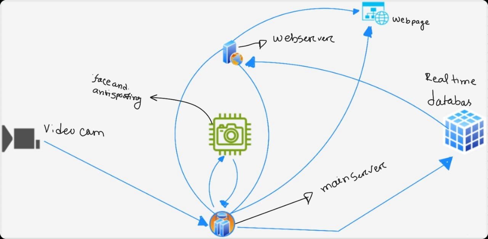
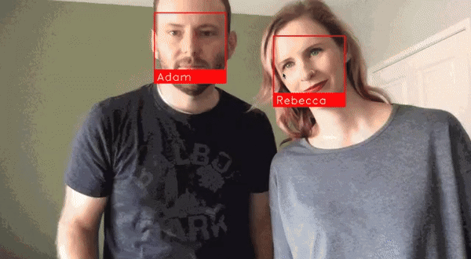
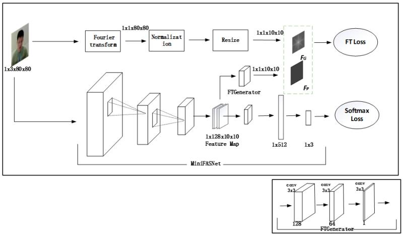

# liveattendence_with_anti_cheat

**Secure Face Login with Liveness Detection (Python & React)**

This repository implements a secure face login system using:

- **Face Detection:** Utilizes Python libraries like OpenCV or Dlib to detect faces in real-time video streams.
- **Anti-Spoofing:** Employs deep learning models trained on liveness detection datasets to distinguish real faces from spoofing attempts (photos, videos).
- **React Frontend:** Built with React for a user-friendly and interactive login experience.

This project offers:

- **Enhanced Security:** Prevents unauthorized access through photo or video spoofing.
- **Real-time Processing:** Performs face detection and liveness checks in real-time for seamless user interaction.
- **Open-Source Code:** Accessible on GitHub for learning, customization, and contributions.

Covers Modules:

- face detection
- face recognition
- liveness detection
- anti-spoofing
- deep learning
- Python
- OpenCV
- Dlib
- React
- secure login
- biometrics
- authentication

# FontEnd
-----------
### Login Page

### BackEnd 

-  ### Face recognition 
- ### Anti-Spoofing 
- ### FastAPI
- ### Firebase[As realtime Database]

## Backend Stracture 

## working process of Face recognition

### [How the  Face Recognition Work using deeplearning ](https://medium.com/@ageitgey/machine-learning-is-fun-part-4-modern-face-recognition-with-deep-learning-c3cffc121d78)

## Antispoofing 

### [How to antispoofing work ](https://github.com/minivision-ai/Silent-Face-Anti-Spoofing)

###  example:

#  Work Flow 

	✅ EncodeFace ✅ Database Connection ✅ Upload encode Picture to Database ✅Setup plugins ✅Fontend ✅ Building API ✅ Authentication ✅ RealtimeDatabase Sync                                        ❌ Connect Backend With Fontend        ❌ Deploy App

